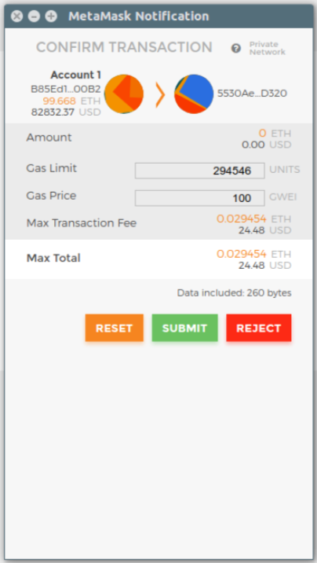
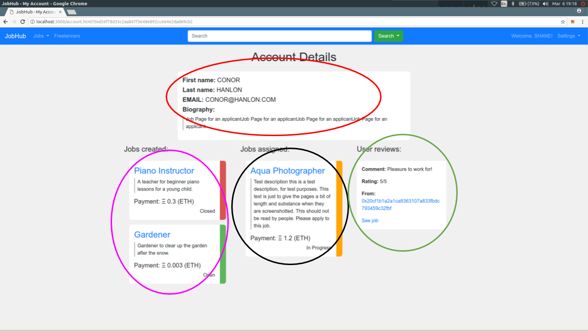
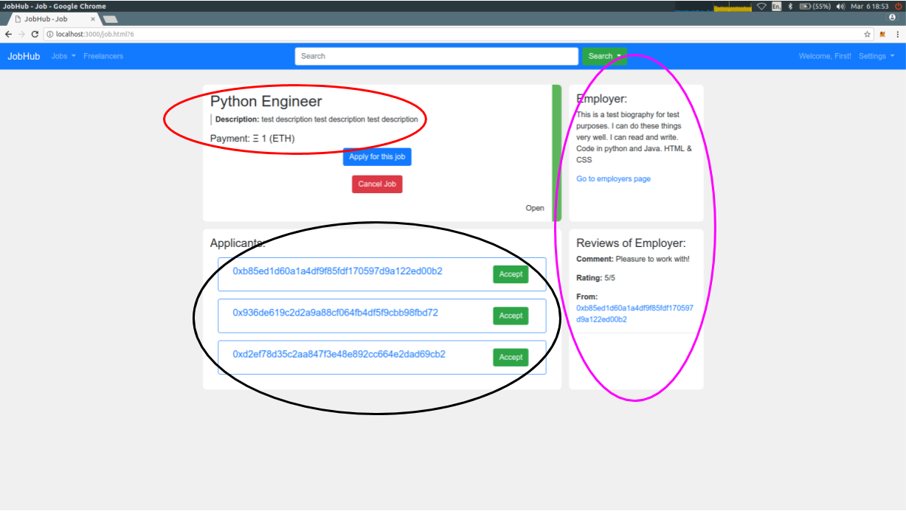
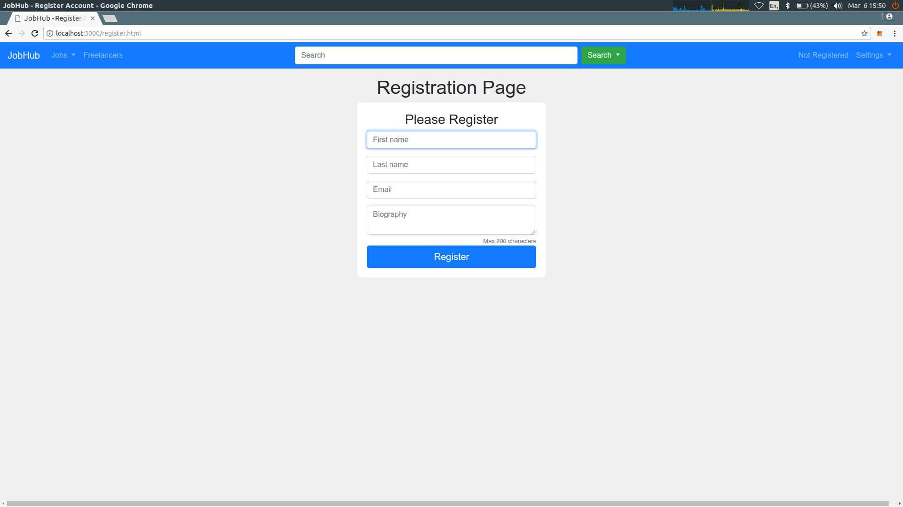
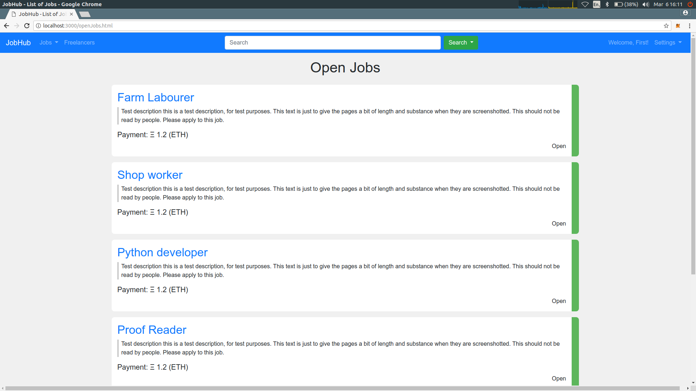
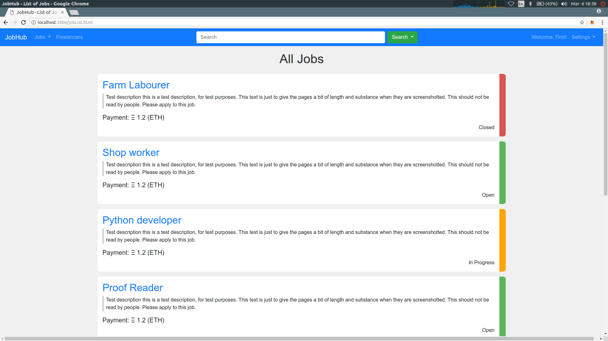
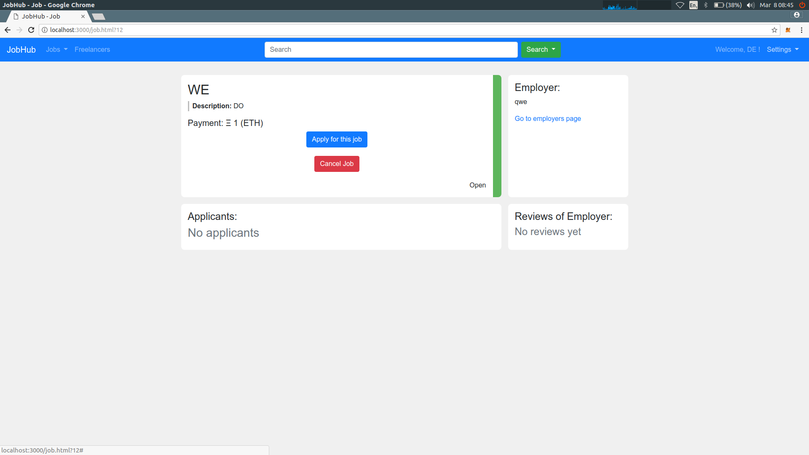
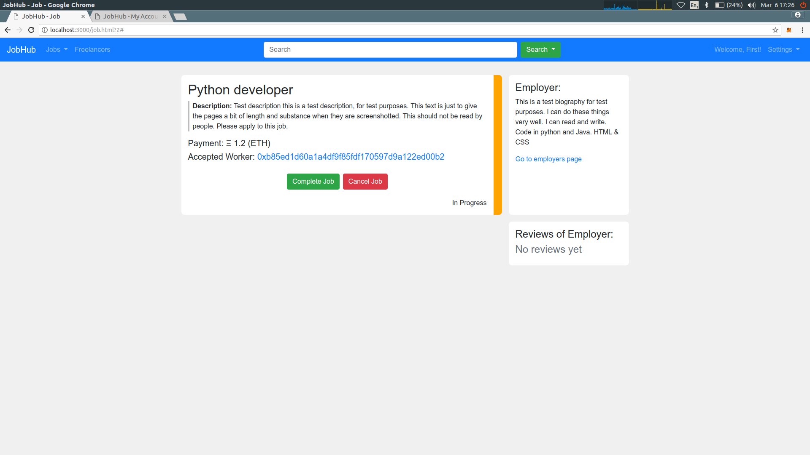
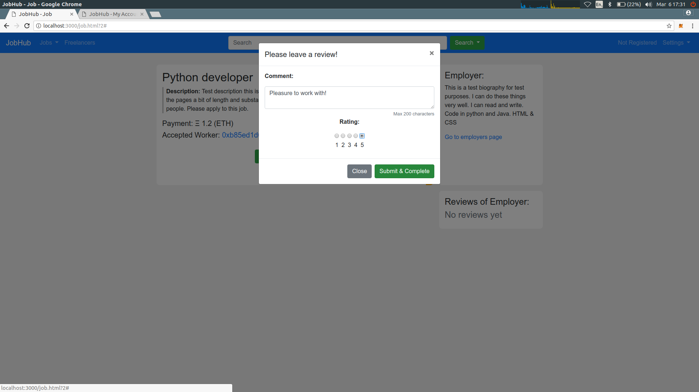
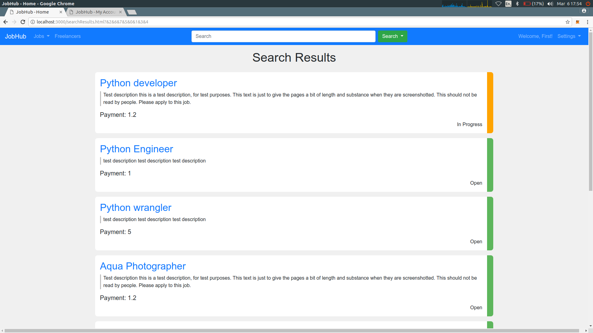

# Open Freelance hub
## User Manual
###### Dean Lynch & David Weir

### Table of Contents
* [1. General](#1-general)
* [2. Page Walkthroughs](#2-page-walkthroughs)
    * [2.1 Navigation Bar](#21-navigation-bar)
    * [2.2 Account Page](#22-account-page)
    * [2.3 Job Page](#23-job-page)
* [3. Functionality Walkthroughs](#3-functionality-walkthroughs)
    * [3.1 Registering an Account](#31-registering-an-account)
    * [3.2 Posting a Job](#32-posting-a-job)
    * [3.3 Browse Jobs](#33-browse-jobs)
    * [3.4 Applying to Work for a Job](#34-applying-to-work-for-a-job)
    * [3.5 Accepting an Application for a Job](#35-accepting-an-application-for-a-job)
    * [3.6 Cancelling a Job](#36-cancelling-a-job)
    * [3.7 Completing a Job](#37-completing-a-job)
    * [3.8 Searching for a Job or User](#38-searching-for-a-job-or-user)

### 1. General

* The homepage provides simple navigation of the site, you can navigate to the job posting page (Green), the register account page (Pink), browse jobs (Red), and browse all users (Black)
* The MetaMask Chrome extension can provide access to ethereum Dapps, the MetaMask pop-up can allows you to approve transactions from your chrome browser. The 'SUBMIT' button will accept the transaction, the 'REJECT' button will cancel the transaction and no ETH will be removed from the user account.

| **Homepage**        |**MetaMask Transaction**|
| ------------- | ------------- |
|     ||

### 2. Page Walkthroughs

##### 2.1 Navigation Bar

* The _jobs dropdown_ on the navigation bar provides access to the open jobs list, the all jobs list and the post a job functionality.(Green)
* The _freelancers_ link will take you to a list of all users on the site.(Pink)
* The _account information_ is displayed on the right side of the navigation bar, it will state "Not registered" when not signed in or signed into an unregistered account. It will show the users firstname when signed into a registered account.(Red)
* The _settings dropdown_ offers links to the account page and displays what type of network the browser is connected to. E.g. Private network or live network.(Black)

| **Navigation Bar**        |
| ------------- |
|     |

##### 2.2 Account Page

* The account information is displayed at the top of the page. Firstname, Lastname, email and biography. (Red)
* A list of jobs created by the account is along the left side. (Pink)
* A list of jobs the account has been a worker on in the centre. (Black)
* A list of previous reviews of the account is along the right side. (Green)

| **Account Page**        |
| ------------- |
|     |

##### 2.3 Job Page

* The job information is displayed at the top of the page. Job title, description, payment amount. (Red)
* Information about the owner of the job is displayed on the right side of the page. Job Owner biography, and a list of passed reviews. (Pink)
* The list of applicants to the job is displayed at the bottom of the page. This is only displayed if the job owner is signed into their ethereum account. (Black)

| **Total Job Page**        |
| ------------- |
|     |

### 3. Functionality Walkthroughs

##### 3.1 Registering an Account

1. Choose either “Not Registered”, "Register Account", or “Settings” and then “My Account”, these will take you to the account registration page.
2.  Input the details for your account and choose “Register”.
3. Approve the transaction for the account registration using your ethereum browser.

| **Account Registration Page**        |
| ------------- |
|     |

##### 3.2 Posting a Job

1. If the account is registered, choose “Jobs” and then “Post a Job”, this will take you to the job creation page.
2. Input the details of the job you wish to post. The maximum size for a title is 50 characters & the maximum size for a description is 500 words.
3. The amount of payment you specify in the payment section will be withdrawn from your ethereum account.
4. Choose “Post Job”.
5. Approve the transaction for the job posting using your ethereum browser.

| **Post Job Page**        |
| ------------- |
|     |

##### 3.3 Browse Jobs

1. Choose “Jobs” and then “Job List” or “Open Jobs”, these will take you to a list of all jobs posted on the site or all open jobs on the site respectively.
2. You can now browse the list of jobs. The status of each job is displayed on the right-hand side of each job card.

| **Open Jobs**        |
| ------------- |
|     |
| **All Jobs** |
|  |

##### 3.4 Applying to Work for a Job

1. After finding a job you wish to apply to enter the job page by clicking on the title of the job.
2. Click “Apply” on the job page.
3. Approve the transaction for the application using your ethereum browser.

| **Job Page for an applicant**        |
| ------------- |
|     |

##### 3.5 Accepting an Application for a Job

1. Enter the job page for the particular job, this page will display a list of all applicants if you are signed in as the owner of the job.
2. From this list, you can choose the “Accept” button beside the applicant you wish to accept. This will assign them as the worker for the job and mark the job as “In Progress”
3. Approve the transaction for worker assigning using your ethereum browser.

| **Job Page for an employer**        |
| ------------- |
|     |

##### 3.6 Cancelling a Job

1. Enter the job page for the particular job.
2. Choose the “Cancel Job” button that is present only if you are the owner of the job.
3. Approve the cancellation transaction using your ethereum browser and the Ether posted when creating the job will be returned to your account.

| **Post Job Page**        |
| ------------- |
|     |

##### 3.7 Completing a Job
1. Assign a worker to a job as explained previously.
2. The worker must mark the job as complete on the job page, the worker complete job button is only present if the worker is logged in.
3. The worker must complete a review of the job owner in order to mark the job as complete.
4. The job owner must “Complete Job” button that is present only if you are the owner of the job and have assigned a worker to the job.
5. The job owner must complete a review of the worker before
6. Approve the transaction for job completion using your ethereum browser.
7. The amount specified in the payment field will be transferred to the assigned worker.

| **Worker completes job **        |
| ------------- |
|     |
| ** Job Owner completes job ** |
|  |
| **Review Pop-up** |
|  |

##### 3.8 Searching for a Job or User
1. From any page on the site click into the search input box and enter the search criteria.
2. Click "Search", and choose either "Search Jobs" or "Search Users".
3. A new page will be generated with the results of the search.

_Note_: The search functionality is a "fuzzy search", it will return all items that match the search criteria in order of how close they match the search criteria.

| ** Search Input **        |
| ------------- |
|     |
|**Search Results** |
|  |
